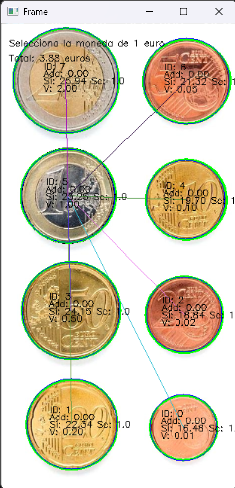

## Ejercicios de la práctica 3

### Contenidos

- [Tarea 1](#1-tarea-1--reconocimiento-de-la-moneda)

- [Tarea 2](#2-tarea-2--reconocDetección-de-microplastico)


### 1. Tarea 1 : Reconocimiento de la moneda


TAREA: Los ejemplos ilustrativos anteriores permiten saber el número de monedas presentes en la imagen. ¿Cómo saber la cantidad de dinero presente en ella? Sugerimos identificar de forma interactiva (por ejemplo haciendo clic en la imagen) una moneda de un valor determinado en la imagen (por ejemplo de 1€). Tras obtener esa información y las dimensiones en milímetros de las distintas monedas, realiza una propuesta para estimar la cantidad de dinero en la imagen. Muestra la cuenta de monedas y dinero sobre la imagen. No hay restricciones sobre utilizar medidas geométricas o de color. 

Una vez resuelto el reto con la imagen ideal proporcionada, captura una o varias imágenes con monedas. Aplica el mismo esquema, tras identificar la moneda del valor determinado, calcula el dinero presente en la imagen. ¿Funciona correctamente? ¿Se observan problemas?


## 1. Modo de funcionamiento
- Modo cámara: Se abre la cámara (`cv2.VideoCapture`) y se captura la imagen en vivo para detectar. 

- Modo imagen estática: seleccionar imagen de archivo para detectar.

- Al hacer **clic izquierdo**, se congela el fotograma que servirá como imagen de referencia (`frame_static`).  
- Se dibuja un rectángulo sobre la moneda de **1 euro** para calibrar el tamaño de todas las demás monedas.  
- Se calcula el **centro**, **diámetro mayor** y **ángulo de inclinación** de la moneda seleccionada.  
- Esta información sirve para **escalar correctamente** las demás monedas detectadas en la imagen.


## 3. Preprocesamiento y detección de contornos
Para cada imagen (referencia o completa):

1. Conversión a **escala de grises**  
2. Suavizado con **GaussianBlur** y **MedianBlur**  
3. Aplicación de **Laplaciano** y **dilatación** para resaltar bordes  
4. Umbralización **automática Otsu** para segmentar la moneda → imagen binaria  
5. Inversión si la cantidad de blanco supera el negro  
6. Detección de **contornos externos** (`cv2.findContours`)


## 4. Cálculo de escala y ajuste por perspectiva
- Cada contorno detectado se ajusta usando la fórmula de **escala por perspectiva**:

$$
\text{scale} = 1 - \alpha \cdot \frac{90 - \text{angle}}{90} \cdot \frac{\text{dist}}{H}
$$

- `dist` = distancia vertical entre el centro del contorno y la moneda de referencia  
- `angle` = ángulo estimado del contorno  

Esto permite **ajustar el diámetro medido según la perspectiva** de la cámara.


## 5. Estimación del valor de la moneda
- Se compara el **diámetro escalado** con un diccionario de tamaños conocidos (`COINS_SIZES`)  
- Se selecciona la **moneda más cercana** al tamaño detectado  
- Se filtran monedas fuera de los rangos válidos (menores a 13.25 mm o mayores a 27.75 mm)  
- Se devuelve: **valor estimado** y **diámetro escalado**


## 6. Dibujo de resultados en la imagen
- Se dibujan:
  - Contorno de la moneda (`cv2.ellipse`)  
  - Círculo con diámetro escalado (`cv2.circle`)  
  - Información de cada moneda: ID, diámetro, escala, valor  
- Se muestra **total estimado** de todas las monedas detectadas  

En la siguiente se muestra la detección aplicada en 3 imagenes que son: Monedas ideales, Monedas de vida real y Monedas con fondo ruidos.
<p float="left">
  
</p>


### 2. Tarea 2 : Detección de microplastico


TAREA: La tarea consiste en extraer características (geométricas y/o visuales) de las tres imágenes completas de partida, y *aprender* patrones que permitan identificar las partículas en nuevas imágenes. Para ello se proporciona como imagen de test *MPs_test.jpg* y sus correpondientes anotaciones *MPs_test_bbs.csv* con la que deben obtener las métricas para su propuesta de clasificación de microplásticos, además de la matriz de confusión. La matriz de confusión permitirá mostrar para cada clase el número de muestras que se clasifican correctamente de dicha clase, y el número de muestras que se clasifican incorrectamente como perteneciente a una de las otras dos clases.


### Flujo de detección y clasificación de microplásticos

### 1. Imágenes de entrenamiento
Se utilizan tres imágenes de entrenamiento:
<p float="left">
  
  
  
</p>


### 2. Preprocesamiento
- Conversión a **escala de grises**  
- Aplicación de **GaussianBlur** para suavizar la imagen  
- Umbralización **adaptativa** usando un promedio de vecindad → **imagen binaria**

### 3. Detección de contornos
- Búsqueda de contornos en la imagen binaria  
- Filtrado por **área mínima** para eliminar falsas detecciones

### 4. Extracción de características
Para cada contorno se calculan:
- **Compacidad**  (C=P^2/A)
- **Ratio de aspecto** (W/H)  
- **Ratio de elipse**  (major_axis / minor_axis)

Estos parámetros se utilizan para la **clasificación de microplásticos**.

### 5. Imagen de prueba
- Procesamiento de `MPs_test.jpg` con el mismo flujo:
  - Gris → Blur → Adaptive Threshold → Contornos  
- Normalización de los parámetros comparando con la **media y desviación** de los valores de entrenamiento

### 6. Cálculo de la puntuación
- Aplicación de **ponderación** a cada parámetro  
- Cálculo de la **distancia Euclidiana ponderada**:

```python
weights = {'compactness': 1.0, 'aspect': 0.3, 'ellipse': 1.0}
total_score = np.sqrt(
        weights['color']*color_score**2 +
        weights['compactness']*compactness_score**2 +
        weights['aspect']*aspect_ratio_score**2 +
        weights['ellipse']*ellipse_ratio_score**2
    )
```
### 7. Comparación
<p float="left">
  
</p>


### 8. Matriz de confusión
**Accuracy = 0.619
Precision = 0.687
Recall = 0.619
F1 Score = 0.612**
<p float="left">
  
</p>