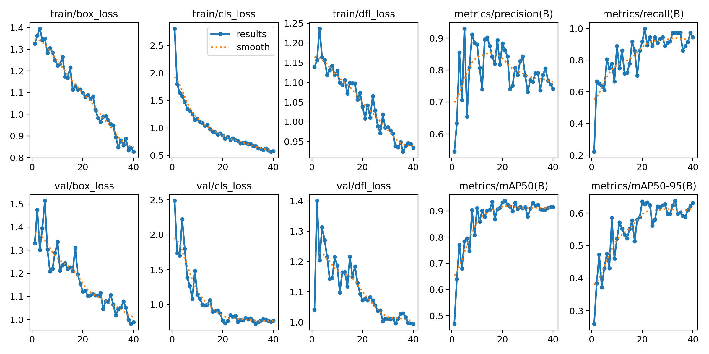
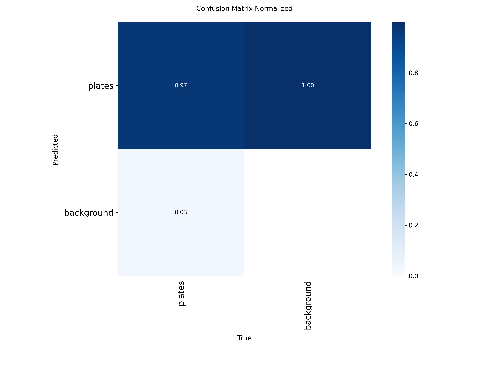
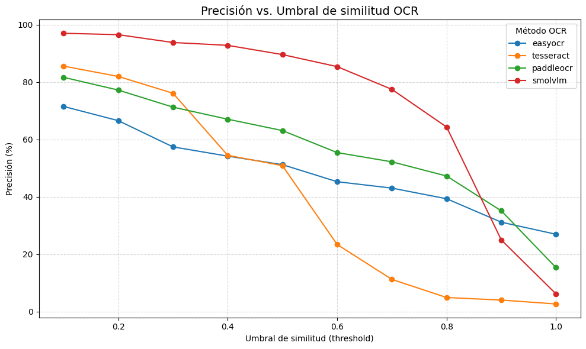
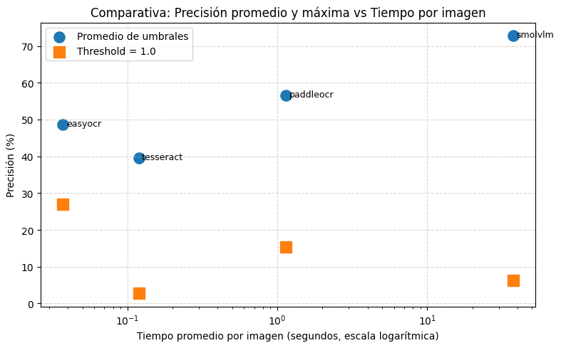

## Ejercicios de la práctica 4 y 4b (Detección y Reconocimiento de Matrículas con YOLO y OCR)

Autores : Anthoy Diego Ávila Arias, Wei Li
### Contenidos
- [Descripción general](#descripción-general)
- [Fuente del dataset](#fuente-del-dataset)
- [Preparación de datos para entrenamiento](#preparación-de-datos-para-entrenamiento)
- [Resultados de entrenamiento](#resultados-de-entrenamiento)
- [Ejecución del modelo con video de prueba](#ejecución-del-modelo-con-video-de-prueba)
- [Comparación de modelos de OCRs](#comparación-de-modelos-de-ocrs)

## Descripción general
Este proyecto implementa un sistema de detección y reconocimiento automático de matrículas de vehículos, entrena el modelo YOLOv11n para la detección y EasyOCR para el reconocimiento de letras de la matrícula. Y finalmente hacer una comparación del tiempo de inferencia y tasa de acierto entre diferentes modelos de OCR.

### Fuente del dataset

Para entrenar el modelo de detección de matrículas, se utiliza el dataset de Kaggle: 
[Car License Plate Detection](https://www.kaggle.com/datasets/andrewmvd/car-plate-detection)

### Preparación de datos para entrenamiento
Se utiliza la herramienta que se encuentra en el archivo [plate_labeler.py](./plate_labeler.py) para completar el proceso de anotaciones.

Las imágenes se dividieron en tres conjuntos:

Train	70%	Entrenamiento del modelo,  Val	10%	Validación durante el entrenamiento y  Test	20%	Evaluación final del modelo.

### Resultados de entrenamiento

  

En los gráficos de **train/box_loss** (error en la predicción de las cajas delimitadoras) y **train/cls_loss** (error en la clasificación de objetos), se observa una disminución progresiva a medida que avanza el número de épocas, lo que indica que el modelo aprende de forma estable y mejora su precisión durante el entrenamiento.

Por otro lado, en las métricas **metrics/precision(B)** (proporción de detecciones correctas respecto al total de predicciones) y **metrics/recall(B)** (porcentaje de objetos reales correctamente detectados), se aprecia un aumento constante, reflejando una reducción de falsos positivos y un incremento en la capacidad del modelo para detectar objetos verdaderos.

las gráficas de segunda fila de validación se ve que siguen la tendencia similar a las de entrenamiento, lo cual significa que no hay sobreajuste.

  

En la gráfica se muestra un **97 %** de las matrículas reales fueron correctamente detectadas como matrículas. El **100 %** del fondo se identificó correctamente como fondo (sin falsos positivos) y un **3 %** de las matrículas reales fueron clasificadas como fondo.

### Ejecución del modelo con video de prueba

1. Se analiza cada frame del video y se detectan coches y personas.

2. Si se detecta un coche, se recorta su bounding box y se envía al modelo YOLO entrenado para matrículas.

3. Si se detecta una matrícula:

    -   Se aplica preprocesamiento de imagen (suavizado, binarización, aumento de contraste, cierre de huecos, etc.).
    -   También se aplica un modelo de super-resolución de super-image.
    -   Se pasa el recorte procesado al modelo EasyOCR para reconocer el texto.
    -   Se almacenan los mejores resultados de OCR para mejorar la presición de la detección.

4. El número detectado se dibuja sobre el video junto al bounding box del vehículo o matrícula.
5. Las matrículas y las caras de las personas se desenfocan.

6. Genera un [video de salida](https://alumnosulpgc-my.sharepoint.com/:v:/g/personal/wei_li101_alu_ulpgc_es/EXYpSjEpYYxGpcHeWBBb4HgBTwUhhA9TPZ4Rwxy7Fk0HyA?nav=eyJyZWZlcnJhbEluZm8iOnsicmVmZXJyYWxBcHAiOiJPbmVEcml2ZUZvckJ1c2luZXNzIiwicmVmZXJyYWxBcHBQbGF0Zm9ybSI6IldlYiIsInJlZmVycmFsTW9kZSI6InZpZXciLCJyZWZlcnJhbFZpZXciOiJNeUZpbGVzTGlua0NvcHkifX0&e=tXw6so) y un [csv](./detecciones.csv) de resultado de la detección obtenida de cada frame.

Este enfoque reduce falsos positivos, mejora la precisión y permite un seguimiento con ID de cada objeto detectado a lo largo del video.

### Comparación de modelos de OCRs
Para obtener una comparación del tiempo de inferencia y tasa de acierto con el dataset de entrenamiento que se usa anteriormente, se ejecuta diferentes modelos de OCR que se encuentra en el archivo [VC_P4b](./VC_P4b.ipynb). 

  

La gráfica muestra que **SmolVLM** mantiene una alta precisión en casi todo el rango de umbrales, aunque a partir de un valor superior a 0.8 su rendimiento comienza a disminuir de forma progresiva.
Los modelos **PaddleOCR** y **EasyOCR** presentan un comportamiento similar entre sí, con una precisión aceptable en umbrales bajos pero una caída más pronunciada al aumentar la exigencia de similitud.
Por su parte, **Tesseract** muestra el peor desempeño general, manteniendo niveles de precisión bajos en todos los umbrales evaluados.

  

Conclusión final: **SmolVLM** ofrece la mejor precisión general, aunque a costa de un tiempo de procesamiento elevado.
**PaddleOCR** representa el mejor equilibrio entre precisión y velocidad.
**EasyOCR** y **Tesseract** siguen siendo opciones viables cuando la prioridad es la rapidez más que la exactitud.
