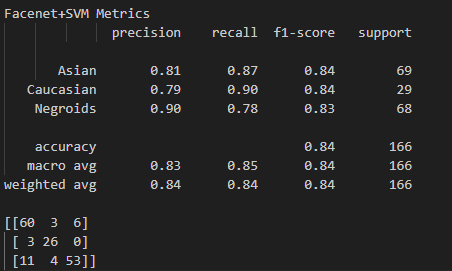
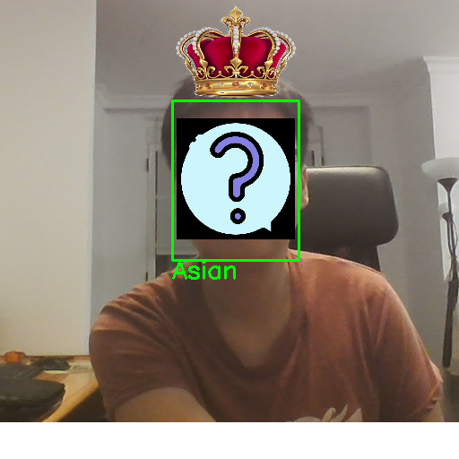

## Ejercicios de la práctica 5. Detección y caracterización de caras

Autores : Anthoy Diego Ávila Arias, Wei Li

### Contenidos
- [Descripción general](#descripción-general)

- [Fuente del dataset](#fuente-del-dataset)

- [Flujo de entrenamiento](#flujo-de-entrenamiento)

- [Resultado de evaluación con kfold](#resultados-de-evaluación-con-kfold)

- [Creación de filtro con detección de raza](#creación-de-filtro-con-detección-de-raza)

- [Creación de filtro de landmarks faciales](#creación-de-filtro-de-landmarks-faciales)

## Descripción general
Este proyecto consta de dos partes:

1. Entrenamiento de un modelo para detectar razas utilizando imágenes capturadas por la webcam.

2. Aplicación del modelo de detección facial, aprovechando la información extraída para crear un filtro visual.

### Fuente del dataset
Para entrenar la detección de razas se ha utilizado el dataset [Races](Races/)
, que incluye **3 clases** diferentes (asiático, caucásico y africano),
con una cantidad de **343, 167 y 336** imágenes respectivamente.

Ejemplo de imagenes:

  
  
  

### Flujo de entrenamiento
El modelo entrena el clasificador **SVM** utilizando **embeddings faciales** de **Facenet**.
Antes de entrenar el modelo, cada imagen pasa por un modelo **Facenet**, que la transforma en un vector de características. 
Este vector captura la información relevante del rostro.

Un **SVM** aprende buscar el hiperplano que mejor divide las clases y separar los embeddings de distintas razas en el espacio vectorial.

Paso de entrenamiento de **SVM**:
1. Normalización con **MinMaxScaler**
2. Búsqueda automática de hiperparámetros mediante **GridSearchCV** para encontrar la mejor combinación de **C** y **gamma**.
3. Entrenamiento del **SVM** óptimo utilizando los hiperparámetros encontrados.

### Resultados de validación con kfold
Se usa **StratifiedKFold** (5 folds) para evaluar los modelos de forma estable:
- Cada fold entrena con el **80%** de los **embeddings**.
- Evalúa con el **20%** restante.
- Mantiene siempre el equilibrio entre clases.

Esto permite obtener métricas promedio fiables para comparar modelo.
Cada modelo se evalúa en cada fold mediante:

- **Precisión**
- **Recall**
- **Classification report**
- **Matriz de confusión**

El resultado completo de la validación se encuentra en [result.txt](result.txt).

### Creación de filtro con detección de raza
1. Se utiliza un modelo **DNN** para localizar caras en cada frame.
2. Cada rostro detectado se procesa con **Facenet** para generar un **embedding facial**.
3. El **embedding** se normaliza con un **scaler** previamente entrenado.
4. Se predice la clase **(Asian, Caucasian o African)** usando un clasificador **SVM** entrenado.
5. Según la raza predicha, se selecciona una imagen de corona correspondiente. La corona se superpone sobre la cabeza del sujeto utilizando **alpha blending**, respetando tamaño y posición.

Resultado de filtro:

  

### Creación de filtro de landmarks faciales
1. Se detecta la cara y los ojos usando **FaceDetectors**.
2. Se identifican 68 **landmarks faciales**.
3. Se puede colocar accesorios sobre los landmarks haciendo clic con el ratón y quitarlos con el clic derecho.
4. Soporta efectos dinámicos, como lágrimas animadas que caen desde los ojos (q, e, s).
5. Los accesorios se pueden cambiar con teclas (d, a).
6. Se muestran loas landmarks con la tecla (space)

Resultado de filtro:

https://github.com/user-attachments/assets/7166a028-f8c5-4494-825a-6654cb2cd162

